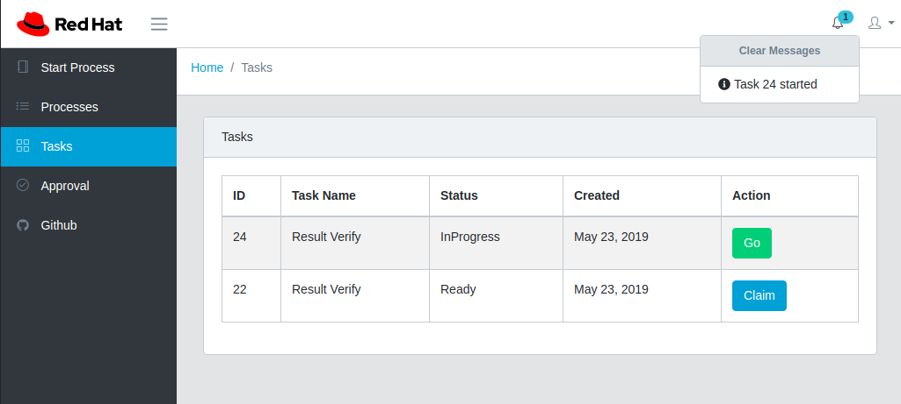
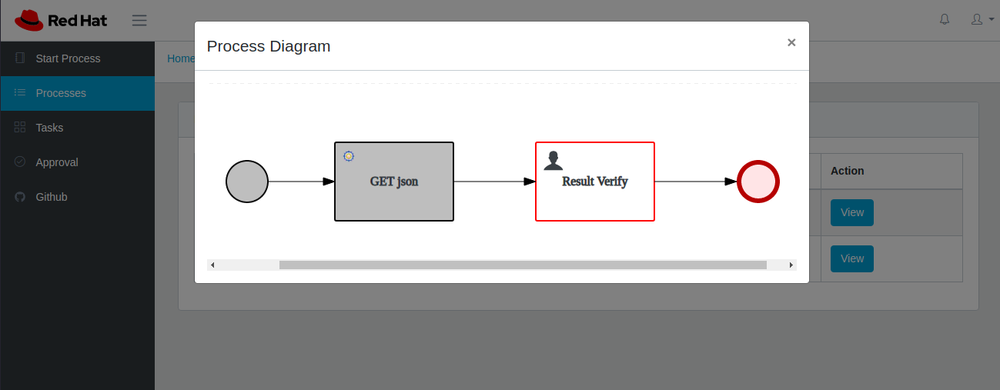

# Sample Frontend for Red Hat Process Automation Manager

This application is a starter for a custom frontend that works with the [rhpam7-install-demo](https://github.com/jbossdemocentral/rhpam7-install-demo) project to install [Red Hat Process Automation Manager](https://www.redhat.com/en/technologies/jboss-middleware/process-automation-manager)





## Install

This application assumes you have installed the [rhpam7-install-demo](https://github.com/jbossdemocentral/rhpam7-install-demo) on your [Openshift](https://www.openshift.com/) instance

* Run this script to deploy the application in the same project as **rhpam7-install-demo**
>`ocp-deploy-angular.sh`

* Import a sample process and deploy in business central from [ocp-pam-process](https://github.com/mechevarria/ocp-pam-process)

* After deployment you can start a process, view a process and complete tasks in the customer interface

## Develop

* Edit the `KIE` environment variable in the `run-local.sh` script to be the route to your deployed kie-server.

* Make sure you have a [nodejs](https://nodejs.org/en/) runtime installed

* Install dependencies with 
>`npm install`

* In one terminal, start a dev build that watches source files and rebuilds automatically

> `npm run buildDev`

* In a separate terminal run the express server

>`run-local.sh`

The server will be running on [http://localhost:4200](http://localhost:4200)

## Additional Development Notes

* [vscode](https://code.visualstudio.com/) has out of the box support for Angular projects

* If you need call any external REST services, add a proxy entry in `server.js`. **Example:** backend calls to `/jsonplaceholder` will be proxied. Without the proxy you will receive [CORS](https://developer.mozilla.org/en-US/docs/Web/HTTP/CORS/Errors) errors. 

```javascript
// proxy jsonplaceholder
app.use(
  '/jsonplaceholder/*',
  proxy({
    target: "http://jsonplaceholder.typicode.com",
    secure: false,
    changeOrigin: true,
    logLevel: 'debug',
    pathRewrite: {
      '^/jsonplaceholder': ''
    }
  })
);
```

* This application is fully compatible with the [angular cli](https://cli.angular.io/) to generate web components

* The `sso-scripts` folder has deployment scripts that will integrate [Red Hat Process Automation Manager](https://www.redhat.com/en/technologies/jboss-middleware/process-automation-manager) with [Red Hat Single Sign-On](https://access.redhat.com/products/red-hat-single-sign-on). The security realm can also be imported.

* This is a work in progress since you can authenticate and deploy projects, but you cannot clone the internal git repository yet to export work from Openshift